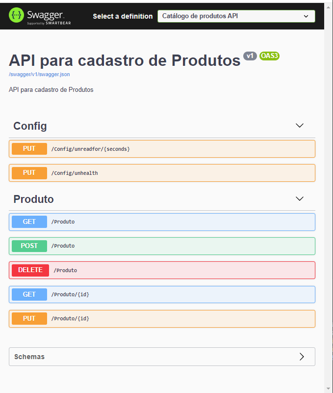

# Observability with Prometheus and Grafana

### Start the environment
- [x] Docker-compose up -d

### Check if environment is running
- [x] docker container ls

### Remove container
- [x] docker container rm -f id-do-container

### Remove all containers
- [x] docker rm $(docker ps -a -q)

### Mongodb Exporter
- [x] http://localhost:9216/metrics

### API metrics
- [x] http://localhost:8080/metrics

### DOCKER
#### REMOVE ALL IMAGES
- docker rmi -f $(docker images -q)

#### REMOVE ALL VOLUMES
- docker volume rm $(docker volume ls -q)
- docker volume prune -f

